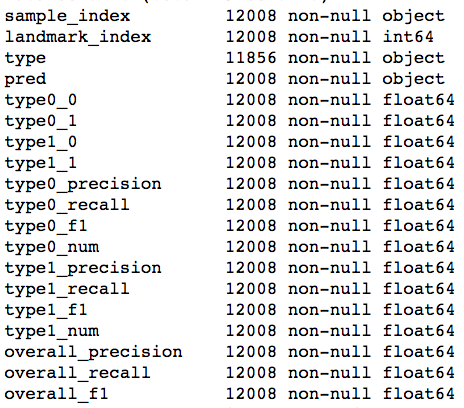

```{r, echo=FALSE, message=FALSE, warning=FALSE}
library(reticulate)
library(knitr)
opts_chunk$set(tidy.opts=list(width.cutoff=60), tidy=FALSE)
knitr::opts_chunk$set(fig.pos = 'h')
```

\newpage

# Introduction
This project derives from Professor Barresi’s biological image analysis research at Smith College and provides a tool to classify the structures within Zebrafish brains via support vector machine. Our goal is to distinguish the wild and mutant types of Zebrafish brain’s structures. Schwartz [@Sch2018], a student in Barresi Lab, used  landmarks analysis to divide the points in the three-dimensional images into small wedges and computed the landmark, which is the most representative point, within each wedge. The image of signals in a Zebrafish brain is shown in Figure 1. The shape is divided into 30 slices, and each slice is further divided into 8 wedges. The landmark in each wedge is calculated by taking the median distance of all points in each wedge, $R$. We use the number of points in each wedge and median $r$ to run SVM models to run classifications.  

## Programming Languages
Two programming languages are used in this study: Python and **R**. Python is used to run our model and output the result in the correct format. **R** is used generally for data cleaning and creating interactive user interface.

## Git, `knitr`, and Reproducible Research
Reproducible research and open source are two main points of emphasis in this honors project. As scholars place more emphasis on the reproducibility of research studies, it is essential for us to make our code publicly available for people to recreate both the model and the user interface. 

`knitr` [@pkgknitr] and Github are used in this project to make the study reproducible, ranging from the initial data source to the `nyctaxi` package to the statistical data analysis. We used an **R** package called `rticles` to write this paper. This tool allows authors to create reproducible and dynamic technical scientific paper in **R** Markdown. It also allows users to embed **R** code and interactive applications, and output into PDF. `rticles` helps users to efficiently put together scientific paper with similar format [@pkgrticles]. Github is used to store the scripts for our final paper, and the source code for our final production which contains the final model and user interface.

# Literature Review
Research in developmental biology has relied on the analysis of morphological phenotype through
qualitative examination of maximum intensity projections that surrender the power of three dimensional
data. Statistical methods to analyze visual data are needed, particularly to detect subtle
phenotype [@Sch2018].

####Landmark Analysis

Landmarks describe a shape by locating a finite number of points on each specimen. There are three basic types of landmarks: scientific, mathematic and pseudo-landmarks. A scientific landmark is a point assigned by an expert that corresponds between objects in some scientifically meaningful way, for example the corner of an eye. Mathematical landmarks are points located on an object according to some mathematical or geometrical property of the figure. Since it does not assume a preference of one location to another, it is particularly useful in automated morphological recognition and analysis for under-studied structure. Pseudo-landmarks are constructed points on an object, located either around the outline or in between scientific or mathematic landmarks. It is often used to approximate continuous curves [@Dryden2016]. This research has chosen to calculate an automatic set of landmarks distributed across the structure in order to avoid introducing bias due to expectations about where biological differences should emerge.

Schwartz et al. [@Sch2018] have utilized the open source program, Ilastik, which employs a training based machine learning, to eliminate the image noise. Then they preformed principal component analysis to align commissures between samples, reducing misalignment artifacts, and implemented a cylindrical coordinate system which preserves image dimensionality normally lost in maximum intensity projection (MIP), which facilitates presentation of the data, but sacrifices much of the complexity and relational data contained in the image. Then they reduced the points identified by the program as belonging to the structure to a set of landmark points that describe the shape and distribution of signal corresponding to the structure. Finally, using the landmark system, we are able to identify and quantify structural differences and changes in signal distribution between wild type and mutant commissures. 


####Support Vector Machine

Schwartz et al.[@Sch2018] used Random Forest machine leaning method to classify the landmarks. Although the classification is quite accurate, it is difficult to interpret the result from biological aspects. Instead of doing classification on all of the landmarks at the same time, we decided to do classification on one landmark at a time via Support Vector Machine. The SVM algorithm is a classification algorithm that provides state-of-the-art performance in a wide variety of application domains, image classification. During the past few years, SVM has been applied very broadly within the field of computational biology especially in pattern recognition problems, including protein remote homology detection, microarray gene expressions analysis, prediction of protein-protein interactions, etc. In 1999, Jaakkola et al [@Jaakkola1999] ushered the development of homology detection algorithms with a paper that garnered the “Best paper” award at the annual Intelligent Systems for Molecular Biology conference. Their primary insight was that additional accuracy can be obtained by modeling the difference between positive and negative examples. Because the homology task required discriminating between related and unrelated sequences, explicitly modeling the difference between these two sets of sequences yields an extremely powerful method. 

# Data and Variables
```{r fig.cap = "\\label{landmark} Landmark Data of One Sample", fig.align='center', echo=FALSE}
knitr::include_graphics("figures/landmark.png", dpi = 260 )
```

We have 43 wild types samples ($n_1$) and 35 mutant samples ($n_2$) for training and testing. There are 152 landmarks ($N$) for each sample, which resemble **Fig \ref{landmark}**, with each of them containing the following variables:

* number of points in each wedge
* median $r$ (micro-meter): the median of the distances to the center of the slice of all the points in each wedge
* $\alpha$ (micro-meter): distance from the center of the landmark to the midline
* $\theta$ (radian): the degree the describes the location of a wedge within each slice

We used the number of points and the median $r$ to do classification via support vector machine. For missing median $r$ values due to absence of points in particular wedge, we filled them with the median value of all the points in that wedge.

## Tidy Data
The raw landmarks data is a wide table containing the sample index and all the columns holding information regarding the minimum and maximum values of $\alpha$ and $\theta$, number of points, median $r$ value, and the type of sample for a particular sample in each landmark.  and The value in each cell refers to the median $r$ value or number of points. However, because all of such variables were joined by underscores in the variable names, such as `-14.29_-4.76_-0.79_0.0_50_pts` or `-14.29_-4.76_-0.79_0.0_50_r`, it was very difficult to see what each column actually represented. Thus, the data set was restructured to have the sample index, minimum and maximum $\alpha$, minimum and maximum $\theta$, number of points, median $r$, and type of sample each be its own column. 

Hence, three key functions were used from the tidyr package [@pkgtidyr]: gather(), separate(), and spread(). The gather() function separated the dataset into key and value pairs for each index. The key was the column name containing all essential information connected by underscores and the value included the number of points or median $r$ value. Then, the separate() function separated the result from the gather function divided the column connected by underscore into 5 different columns, named as `min_alpha`, `max_alpha`, `min_theta`, `max_theta`, and `ptsOrR`. This was added to the result of the gather function that contained the index and value of each cell, either median $r$ or number of points. Afterwards, the spread() function widened the already wide table by expanding the `ptsOrR` column by creating two columns, each column representing median $r$ and the number of points. 

## Dealing with Missing Values
Support Vector Machine (SVM) cannot be fit to data with missing values. For wedges that do not have any points, median $r$ cannot be calculated, which means that these sample will be eliminated when running SVM. Wedges without points have biologically meanings, so we should not ignore these wedges in our model. In order to keep the wedges in our model, we need to artificially pick a median $r$ value to replace the missing ones. From biological perspective, the reason that there is no point in a particular wedge might be that the data points are too far away from the scanned area to be captured. Therefore, we decided to calculate the mean of median $r$ for the nth landmark of all 78 samples, and then we replace the missing median $r$ values with the $2$ $\cdot$ median $r$ value for each landmark of each channel to represent that the points in this wedge is far away from the scanned area.

# Support Vector Machine 
The goal of SVM is to find a separation line $f(x) = (\beta_0 + \beta_1 \cdot x_1 + \beta_2 \cdot x_2)$ that separates the data points as cleanly as possible as shown in **Fig \ref{svmfig}** below. The optimal parameters $\beta$ are found by solving the optimization problem --to maximize margin subject to certain restrictions [@James2013].

```{r fig.cap = "\\label{svmfig} SVM model", echo=FALSE}
knitr::include_graphics("figures/svm_fig.png", dpi = 260 )
```

\begin{equation}
  \left.
  \begin{array}{l@{\,}l}
     \sum_{i=1}^n \beta_i^2 = 0 \\
     \ y_i \cdot ( \beta_0 + \beta_1 \cdot x_1 + \beta_2 \cdot x_2 ) \geq M(1-\varepsilon_i) \\
     \ \varepsilon_i \geq 0 \\
     \ \sum_{i=1}^n \varepsilon_i \leq C \\
  \end{array}
  \right.
\end{equation}


* $M$: Margin is the sum of distance of the two closest points from each class to the separation line. 
* $\varepsilon_i$ : slack variable.
* $C$: Tuning parameter, toleration of total misclassification.

The slack variable $\varepsilon_i$ tells us where the $i^{th}$ observation is located, relative to the separation line and the margin. If $\varepsilon_i = 0$ then the $i^{th}$ observation is on the correct side of the margin. If $\varepsilon_i > 0$ then the $i^{th}$ observation is on the wrong side of the margin. If $\varepsilon_i > 1$ then it is on the wrong side of the separation line.

The tuning parameter C bounds the sum of the $\varepsilon_i$, and therefore determines the number and severity of the violations to the separation line and margin that we will tolerate. We can think of C as a budget for the margin can be violated by the n observations. If $C = 0$ then there is no budget for violations to the margin, and it must be the case that $\varepsilon_1 = . . . = \varepsilon_n = 0$. For $C > 0$ no more than C observations can be on the wrong side of the separation line, because if an observation is on the wrong side of the separation line then $\varepsilon_i > 1$. As the budget C increases, we become more tolerant of violations to the margin, and so the margin will widen. Conversely, as C decreases, we become less tolerant of violations to the margin and so the margin narrows.

$y_i$ is the vector representing the coordinate of a data point. The dot product of $y_i$ and the function of the separation line gives the perpendicular distance from the data point to the separation line:

$$y_i \cdot ( \beta_0 + \beta_1 \cdot x_1 + \beta_2 \cdot x_2 )$$

If the dot product is greater than 0, the observation falls at the right side of the separation line and vice versa. 

In general, we want to find a classification that the distance from a data point to the separation line is larger than the margin, while we can tolerate some points being in the middle of the margins or misclassified. 

## Cross-Validation
For our project, we have access to 43 wild-type samples and 35 mutant-type samples. Due to this limited sample size, we decided to use a leave-one-out cross validation method to test our model. For each testing sample, we built 152 SVMs: one for each landmark.
For each SVM, we used 10-fold cross validation to select a tuning parameter C value among 0.1, 1 and 10.

# Final Product: Two-Step Interactive Classification Tool
We created a two-step interactive classification tool which allows users to simply input a data file and get an visualization of the modeling result. There are two main components in the tool:

## General Workflow

```{r fig.cap = "\\label{workflow} Summary of Workflow", fig.align='center', fig.height = 5, fig.width=4, echo=FALSE}
knitr::include_graphics("figures/Figure1.jpg", dpi = 260 )
```

**Fig \ref{workflow}** displays the overall workflow leading to the final product of classification. It begins with the cleaning and restructuring of the raw landmarks data. The tidied landmarks data that has the NA values filled contains 152 distinct landmarks. Each landmark has its own representative SVM model that used the 77 samples out of 78 for training from applying the leave-one-out cross validation method. That one sample that is left out from each landmark is used for testing the model that was built from the 77 samples. Then, based on the training accuracy of each model, only those that consist of reliable landmarks are filtered out. The number of wild types and mutants predicted with each model are calculated and this leads to the final classification result of using SVMs. 

## Step One: Data Processing and Modeling
This step is implemented using Python (version 3) and packages including `pandas`, `numpy` and `sklearn` are required. Users would need to run and interact with the Python script `svm.py` to preprocess the data and build the model. Then, they would need to run another script `analyse_results.py` to analyse the raw results and produce aggregated results.   

The script `svm.py` contains two components: a general-purpose `svm_classification()` function that builds a SVM model to classify points for a particular landmark and a `main()` function that runs the `svm_classification()` function for each landmark.

The script `analyse_results.py` contains three components: a helper function `get_result_file_pathes()` that returns a list of result file paths in the output folder; a helper function `process_row_data()` that takes a path of raw data file and returns one with accuracy scores calculated and attached; a `main()` function that runs the two helper function to process all raw data files and generates an aggregated `CSV` file containing results from all samples.

### User Interaction
```{r fig.cap = "\\label{useri} Example of User Interaction in Step One of the User Interface", fig.align='center', echo=FALSE}
knitr::include_graphics("figures/Figure2.jpg", dpi = 260 )
```

```{r fig.cap = "\\label{useri2} Example of User Interaction for Running svm.py", fig.width=5, fig.height=3,echo=FALSE}
knitr::include_graphics("figures/Figure4.png", dpi = 260 )
```

As shown in **Fig \ref{useri}** and **Fig \ref{useri2}**, several user inputs are taken from users when they run the python scripts.

### Input File 
Input file must contain landmark data. Variables that are needed for classification are required to be included in the input file. In our analysis, we used number of points in each wedge within the 3D shape and the median $r$ of points in each wedge.

### Sample input file

```{r fig.cap ="\\label{inputdata} Sample Data Input File of First Step of the User Interface", fig.align='center', out.width = "300px", echo=FALSE}
knitr::include_graphics("figures/Figure3.png", dpi = 260)
```

**Fig \ref{inputdata}** shows a random sample of an input file for the script `svm.py`. The columns `stype` (sample type), `landmark_index` and `sample_index` are required and the other two columns (`pts` and `r` in this example) are the two parameters used for building SVM.

### Output File

```{r fig.cap ="\\label{outputdata} Sample Data Output File of First Step of the User Interface", fig.align='center', out.width = "300px", echo=FALSE}

```

**Fig \ref{outputdata}** shows the columns of the final result file produced by the `analyse_results.py` script. The first four columns describe the testing sample's information while the rest of the columns are all precision statistics describing the accuracy of the built model. The descriptions of all of the columns are displayed as follows:

* `sample_index`: sample index of the testing sample
* `landmark_index`: the index of the landmark
* `type`: the actual type of the testing sample
* `pred`: the prediction made by the model
* `type0_0`: number of type 0 samples that are classified as type 0 in the corresponding landmark's SVM
* `type0_1`: number of type 0 samples that are classified as type 1 in the corresponding landmark's SVM
* `type1_1`: number of type 1 samples that are classified as type 1 in the corresponding landmark's SVM
* `type1_0`: number of type 1 samples that are classified as type 0 in the corresponding landmark's SVM
* `type0_precision`: percentage of samples that are classified by the corresponding landmark's SVM as type 0 are really of type 0
* `type0_recall`: percentage of type 0 samples that are classified by the corresponding landmark's SVM as type 0.
* `type0_f1`: harmonic mean of `type0_precision` and `type0_recall`
* `type0_num`: number of type 0 samples in the training dataset
* `type1_precision`: percentage of samples that are classified by the corresponding landmark's SVM as type 1 are really of type 1
* `type1_recall`: percentage of type 1 samples that are classified by the corresponding landmark's SVM as type 1
* `type1_f1`: harmonic mean of `type1_precision` and `type1_recall`
* `type1_num`: number of type 1 samples in the training dataset
* `overall_precision`: weighted average of `type0_precision` and `type1_precision`
* `overall_recall`: weighted average of `type0_recall` and `type1_recall`
* `overall_f1`: weighted average of `type0_f1` and `type1_f1`


## Step Two: Interactive Visualization Tool
After building SVM models in step one, we insert the output from the SVM models into step two to visualize the results. Steps two uses the accuracy scores output from step one to create a user-friendly app which generates visualizations to help users to understand the SVM results. 

The repository containing the shiny app can be access by doing the following:
```{r, eval=FALSE}
install.packages("devtools")
devtools::install_github("liwencong1995/SDS-Capstone-Zebrafish")
```

The file containing the source code of the shiny app can be found in `9.FinalModel` folder of the repository. The file is named as `shiny_app.R`.

### Input 1: Data File and Variables
Input `CSV` data file must be stored in a folder called `data` under your working directory, and the `CSV` file must be named as `output_data.csv`. If you do not know what your working directory is, you can check it by using the function `getwd()` in base **R**.

All SVM models from step one produce the following 9 accuracy measurements:

1. Precision score of type 0
2. Recall score of type 0
3. F1 score of type 0
4. Precision score of type 1
5. Recall score of type 1 
6. F1 score of type 1
7. Overall precision score
8. Overall recall score
9. Overall F1 score

These 9 accuracy scores are the variables needed in the second step of the user interface to create the visualizations. 

### Input 2: User Inputs
Users can select `channel` and `sample index` to filter the input dataset to only keep the observations that users are interested in.

In addition, users can set the threshold of the following variables:

* Overall precision score
* Overall recall score
* Overall F1 score

The dataset used to create the visualizations is rendered every time users change one or multiple thresholds. Our app filters out the observations that do not fulfill the threshold requirements and uses the resulting dataset to update the histograms and heat maps. 

### Output: Interactive User Interface
This interactive user interface was built upon several **R** packages:

* `dplyr` [@pkgdplyr]
* `data.table` [@pkgdatatable]
* `ggplot2` [@pkgggplot2]
* `shiny` [@pkgshiny]

We visualize the 9 accuracy scores by using both histograms and the corresponding heat maps that display the scores included in the histograms in rectangular shapes that are colored with different shades of blue according to their magnitudes. The positions of the shapes are determined with respect to their relative positions within the biological structure. In the study of Zebrafish, we used the relative positions of the wedges used in landmark analysis to determine the position of the wedges in the heat map.

There are 10 tabs included in the user interface of the app: 1 Accuracy Threshold Summary tab and 9 accuracy score visualization tabs.

```{r fig.cap= "\\label{shiny1} User Interface: Accuracy Threshold Summary Tab of AT Channel", fig.align='center', echo=FALSE}
knitr::include_graphics("figures/shiny1.png", dpi = 260 )
```

**Fig \ref{shiny1}** displays the Accuracy Score Threshold Summary tab of the first sample of AT channel. Users can drag the dot on the slidebar to set the thresholds of overall precision, recall, and f1 scores. The threshold of the three scores are updated in the summary table. Default thresholds are 0 for all three accuracy measurements. We then use the landmark observations that fulfill the threshold requirements to predict the type of the sample of choice by doing a majority vote. We simply count the total number of landmarks that are classified as type 0 and type 1, and then we determine whether there are more of them that are classified as type 0 or type 1. The type that gets more vote is the predicted type of the sample. The resulting predicted sample type is also updated in the summary table.

Other information, such as the true type of the sample and the number of wild types and mutants used in training the SVM models are also included in the summary table.

```{r fig.cap= "\\label{shiny2} User Interface: Precision Score Visualization Tab of AT Channel", fig.align='center', echo=FALSE}
knitr::include_graphics("figures/shiny2.png", dpi = 260 )
```

**Fig \ref{shiny2}** displays the Precision Score Visualization tab of the first sample of AT channel. In this case, all three thresholds are at default level, 0. All landmarks' precision scores are shown in both the histogram and the heat map.

```{r fig.cap= "\\label{shiny3} User Interface: Precision Score Visualization Tab of AT Channel, with precision threshold = 0.75", fig.align='center', echo=FALSE}
knitr::include_graphics("figures/shiny3.png", dpi = 260)
```

**Fig \ref{shiny3}** also displays the Precision Score Visualization tab of the first sample of AT channel. In this case, recall and f1 scores' thresholds are at default level and precision threshold is set to be 0.75. Therefore, only landmarks that have precision scores that are equal to or greater than 0.75 are shown in the visualizations. As shown in the histogram, all values less than 0.75 are removed from the histogram in figure 6. Some of the blocks in figure 6 are turned into blank blocks after the precision threshold is increased to 0.75.

```{r fig.cap= "\\label{shiny4} User Interface: F1 Score Visualization Tab of ZRF Channel", fig.align='center', echo=FALSE}
knitr::include_graphics("figures/shiny8.png", dpi = 260 )
```

Users can also choose to observe the SVM results of ZRF channel. **Fig \ref{shiny4}** displays the Precision Score Visualization tab of the first sample of ZRF channel with all thresholds equal to 0. More sample visualizations of other accuracy scores can be found in Appendix A. 

# Conclusion and Discussion
## Strengths
Our final product has several strengths:

### Easy Interpretation
In the previously used random forest method, the number of predictors $p$ exceeds the number of samples. Schwartz [@Sch2018] applied the Principle Component Analysis to reduce the dimension of the predictors. The problem with reducing the dimension is that the parameters gaining weights at last are linear combinations of the original landmarks. While the patterns of the first several projections still make sense, the minor projections are very random and thus difficult to interpret. 

The SVM model run on each landmark data gives insightful analysis of which landmark, or which part of the Zebrafish brain, has more power in making predictions.

### Implementing User Feedback
We have implemented feedback from users in our user interface. Originally, our shiny app only produced visualizations of one channel's data, but we added an additional variable, `channel`, for users to analyze three-dimensional data with more or multiple channels. Because of this improvement, it is more convenient for users to compare and contrast results from different channels.

## Limitations and Improvements
### Interaction Between Channels and sections
Our SVM model only make prediction based on a single channel's information and the SVM is run for one single landmark at a time. It does not consider the interactions between channels and between different sections of the sample.

### Iterating Machine Learning
Instead of cross-validation, iterating machine learning method could achieve better results. In iterative machine learning, we repeat the process of training and testing several times. In the first round, the user gives examples of objects belonging to specific classes and the machine learning algorithm is trained with this data. In the second round, the algorithm shows examples of objects it thinks that belong to these classes. Now, the user merely adds objects to the improved training set which the machine learning algorithm has put into a wrong class. That is, the user only corrects the “misunderstandings” of the algorithm. In this way, we can concentrate on difficult examples of objects that are hard to classify. Such objects may lie close to the decision boundaries or in the periphery in the multidimensional feature space. This iterative process is continued until the machine learning algorithm does not make any mistakes or the classification results do not improve anymore. It will improve our classification results and thus is likely to help make better predictions for unknown type [@Pelkmanslab]. 

## Future Study
### Interaction Between Channels
If more time is given, we could add factors that describe the interaction between channels into our SVM model in order to combine information from multiple channels to predict sample type.

### Improving User Interface
Since we have only received feedback from three users at Smith College, we would love to receive more feedback from other scientists and improve our model and user interface accordingly.

### Improving Model Accuracy

# Acknowledgements
This project was completed in partial fulfillment of the requirements of SDS 410: SDS Capstone. This course is offered by the Statistical and Data Sciences Program at Smith College, and was taught by Professor Benjamin Baumer in Spring 2018.

\newpage

# Appendix A: Shiny App Accuracy Score Visualizations
## Recall Score Visualization tab of the first sample of AT channel
```{r shiny4, fig.cap= "User Interface: Recall Score Visualization Tab of AT Channel" , fig.align='center', echo=FALSE}
knitr::include_graphics("figures/shiny4.png", dpi = 260 )
```

## Recall Score Visualization tab of the first sample of AT channel with recall threshold equals to 0.75
```{r shiny5, fig.cap= "User Interface: Recall Score Visualization Tab of AT Channel, with recall threshold = 0.75", fig.align='center', echo=FALSE}
knitr::include_graphics("figures/shiny5.png", dpi = 260 )
```

\newpage

## F1 Score Visualization tab of the first sample of AT channel
```{r shiny6, fig.cap= "User Interface: F1 Score Visualization Tab of AT Channel", fig.align='center', echo=FALSE}
knitr::include_graphics("figures/shiny6.png", dpi = 260 )
```

## F1 Score Visualization tab of the first sample of AT channel with f1 threshold equals to 0.75
```{r shiny7, fig.cap= "User Interface: F1 Score Visualization Tab of AT Channel, with f1 threshold = 0.75" , fig.align='center', echo=FALSE}
knitr::include_graphics("figures/shiny7.png", dpi = 260 )
```

\newpage

# Appendix B: Source Code for User Interface
## Support Vector Machine
```{r, eval = FALSE}
import pandas as pd
import numpy as np
from sklearn.metrics import confusion_matrix, classification_report
from sklearn.model_selection import GridSearchCV
from sklearn.svm import SVC
from sklearn.metrics import f1_score, precision_score, recall_score

'''
A function that builds a SVM model with linear kernel to classify points
to two classes.

Inputs:
training_landmarks - a pandas dataframe containing all training landmark
					 data.
index              - a perticular landmark id of interest. eg. '101'
x_names            - a list of explanatory variable names.
					 eg. ['pts', 'r']
y_name             - a string representing response variable name.
				 	 eg. 'stype'
class0             - name of the first class. eg. 'wt-at'
class1             - name of the second class. eg. 'mt-at'
C_values           - a list of tunning variable C (penalty parameter
					 of the error term) that the method would grid-search
					 on. Default value is [0.1, 1, 10].

Output:
svm                - the SVM model trained from the training dataset
type0_0            - among the training samples, the number of class0
					 samples with chosen landmark predicted as class0
type0_1            - among the training samples, the number of class0
					 samples with chosen landmark predicted as class1
type1_1            - among the training samples, the number of class1
					 samples with chosen landmark predicted as class1
type1_0            - among the training samples, the number of class1
			 		 samples with chosen landmark predicted as class0
'''
def svm_classification(training_landmarks, index, x_names, y_name, class0,
		class1, C_values = [0.1, 1, 10] ):
    # filter out the landmarks needed
    chosenLandmark = landmarks[landmarks.landmark_index==index]
    chosenLandmark = chosenLandmark[np.isfinite(chosenLandmark['r'])]
    
    # create training and testing data
    X = chosenLandmark[x_names]
    y = chosenLandmark[y_name]

    # check whether both classes exist
    count_1 = chosenLandmark[y_name].str.contains(class1).sum()
    count_0 = chosenLandmark[y_name].str.contains(class0).sum()

    if (count_1 < 2 or count_0 < 2):
        return None, None, None, None, None

    # find the best C value by cross-validation
    tuned_parameters = [{'C': C_values}]
    clf = GridSearchCV(
    	SVC(kernel='linear'),
    	tuned_parameters, cv=10, scoring='accuracy')
    clf.fit(X.values, y.values)
    best_c = clf.best_params_['C']
    
    svc = SVC(C=best_c, kernel='linear')
    svc.fit(X, y)
    
    prediction = svc.predict(X)

    # print confusion matrix
    print("confusion matrix: ")
    cm = confusion_matrix(y, prediction)
    cm_df = pd.DataFrame(cm.T, index=svc.classes_, columns=svc.classes_)
    print(cm_df)

    # Statistics of training precision:
    # number of wild type samples with this landmark
    # predicted as wild type.
    type0_0 =0
    # number of wild type samples with this landmark
    # predicted as mutant type.
    type0_1 = 0
    # number of mutant type samples with this landmark
    # predicted as mutant type.
    type1_1 = 0
    # number of mutant type samples with this landmark
    # predicted as wild type.
    type1_0 = 0
    
    for i in range (len(y)):
        _y = y.values[i]
        _p = prediction[i]

        if _y==class1 and _p==class1:
            type1_1 = type1_1 + 1
        elif _y==class1 and _p==class0:
            type1_0 = type1_0 + 1
        elif _y==class0 and _p==class0:
            type0_0 = type0_0 + 1
        elif _y==class0 and _p==class1:
            type0_1 = type0_1 + 1
    
    return svc, type0_0, type0_1, type1_1, type1_0


if __name__ == "__main__":
    # Get Datafile
    landmarks = pd.DataFrame()
    while(landmarks.shape[0]<2):
        filename = str(input("Please enter dataset's path: "))
        try:
            landmarks = pd.read_csv(filename)
        except Exception:
            print ("Error in reading the file.
            	Please check whether file exists.")

    # Column names
    columns = list(landmarks)
    # Check column names
    if 'stype' not in columns:
        print("Incorrect column names: Please
        	name your sample type's column as 'stype' ")
        exit()
    if 'sample_index' not in columns:
        print("Incorrect column names: Please name your
        	sample index's column as 'sample_index' ")
        exit()
    if 'landmark_index' not in columns:
        print("Incorrect column names: Please name your
        	landmark index's column as 'landmark_index' ")
        exit()

    # Get Parameters' column names
    parameters = list(set(columns) -
    	set(['stype', 'sample_index', 'landmark_index']))

    # Get class names
    class0 = ''
    class1 = ''
    classes = list(set(landmarks['stype'].values))
    while (class0 not in classes):
        class0 = str(input("Please enter name of type 0: "))
    while (class1 not in classes):
        class1 = str(input("Please enter name of type 1: "))

    # Remove rows with NaN values
    for parameter in parameters:
        landmarks = landmarks[np.isfinite(landmarks[parameter])]

    # Get sample id
    sample = pd.DataFrame()
    while(sample.shape[0]<2):
        sample_id = str(input("Please enter a VALID sample index: "))
        sample = landmarks[landmarks.sample_index==sample_id]

    # Get result file's name and create the file with column names
    result_file_name = str(input("Please enter result file path: "))
    result_file = open(result_file_name, 'w')
    result_file.write('sample_index,stype,
    	landmark_index,pred,type0_0,type0_1,type1_1,type1_0\n')
    result_file.close()

    # Get existing landmark ids
    landmark_ids = sample['landmark_index']

    # Get Actual Type (the Label)
    stype = sample.iloc[0]['stype']

    leave_one_out = landmarks[landmarks.sample_index!=sample_id]
    for l in landmark_ids.values:
        print ("=======================================")
        print ("landmark: ", str(l))
        svc, type0_0, type0_1, type1_1, type1_0 =
        	svm_classification(training_landmarks = leave_one_out,
                                                 index = l,
                                                 x_names = ['pts', 'r'],
                                                 y_name = 'stype',
                                                 class0 = class0,
                                                 class1 = class1,
                                                 C_values = [0.1, 1, 10])
        if (svc is None):
            print("One of the classes have too few samples
            	for this landmark, so skipping it.")
            continue

        prediction = svc.predict(sample[
          sample.landmark_index==l][['pts', 'r']])[0]
        result = ','.join(str(x) for x in [
          sample_id, stype, l, prediction,
        	type0_0, type0_1, type1_1, type1_0 ]) + '\n'
        print('result:', result)

        result_file = open(result_file_name, 'a')
        result_file.write(result)
        result_file.close()
```

## Shiny App
### Package Dependency
```{r, eval=FALSE}
# Shiny App---------------------------------------------------
# Loading packages needed in the creation of the Shiny App
library(dplyr)
library(data.table)
library(ggplot2)
library(shiny)
```

### User Input
```{r, eval=FALSE}
# User Input -------------------------------------------------
# Please modify the file directory accordingly
data <- fread("data/output_data_type0.csv")

# List of input variables ------------------------------------
list_of_indices <- c(unique(data$sample_index)) 
# Please add or subtract channels from the list_of_channels accordingly
list_of_channels <- c("type0", "type1")
```

### User Interface
```{r, eval=FALSE}
# User Interface
ui <- fluidPage(
  titlePanel(title=h4("Classification of Wildtype and Mutant 
                      Zebrafish Brains via Computational Method", 
                      align="center")),
  
  # Sidebar containing all input variables
  sidebarLayout(
    
    # User Inputs
    sidebarPanel(
      selectInput("sampleindex", "Sample Index:", list_of_indices),
      selectInput("channel", "Channel:", list_of_channels),
      
      # Input accuracy score threshold: 0-1 intervals
      sliderInput("precision", "Precision Rate Threshold:",
                  min = 0, max = 1,
                  value = 0, step = 0.01),
      sliderInput("recall", "Recall Rate Threshold:",
                  min = 0, max = 1,
                  value = 0, step = 0.01),
      sliderInput("f1", "F1 Rate Threshold:",
                  min = 0, max = 1,
                  value = 0, step = 0.01)
    ),
    
    # Output
    mainPanel(
      tabsetPanel(
        tabPanel("Accuracy Threshold",tableOutput("values")),
        #heatmaps and histograms, side by side
        tabPanel("Type 0 Precision", fluidRow(
          splitLayout(cellWidths = c("40%", "60%"), 
                      plotOutput("plot2"), plotOutput("plot1"))
          )), 
        tabPanel("Type 1 Precision", fluidRow(
          splitLayout(cellWidths = c("40%", "60%"), 
                      plotOutput("plot4"), plotOutput("plot3"))
          )),
        tabPanel("Precision",fluidRow(
          splitLayout(cellWidths = c("40%", "60%"), 
                      plotOutput("plot6"), plotOutput("plot5"))
          )),
        tabPanel("Type 0 Recall", fluidRow(
          splitLayout(cellWidths = c("40%", "60%"), 
                      plotOutput("plot8"), plotOutput("plot7"))
        )), 
        tabPanel("Type 1 Recall", fluidRow(
          splitLayout(cellWidths = c("40%", "60%"), 
                      plotOutput("plot10"), plotOutput("plot9"))
        )),
        tabPanel("Recall",fluidRow(
          splitLayout(cellWidths = c("40%", "60%"), 
                      plotOutput("plot12"), plotOutput("plot11"))
        )),
        tabPanel("Type 0 F1", fluidRow(
          splitLayout(cellWidths = c("40%", "60%"), 
                      plotOutput("plot14"), plotOutput("plot13"))
        )), 
        tabPanel("Type 1 F1", fluidRow(
          splitLayout(cellWidths = c("40%", "60%"), 
                      plotOutput("plot16"), plotOutput("plot15"))
        )),
        tabPanel("F1",fluidRow(
          splitLayout(cellWidths = c("40%", "60%"), 
                      plotOutput("plot18"), plotOutput("plot17"))
        ))
        )
      )
  )
)
```

### Shiny App Server
```{r, eval=FALSE}
# Server------------------------------------------------------
server <- function(input,output) {
  
  #loading data needed to create visualizations
  dat <- reactive({
    
    # Please modify the file directory accordingly
    path <- paste0("data/output_data_", input$channel, ".csv")
    # path <- paste0("7.aggregatedResults/", input$channel, 
    "_2med_renamed_2.csv")
    data <- fread(path)
    
    # Please modify the file directory accordingly
    landmark_xy <- fread("data/landmark_xy.csv")
    # landmark_xy <- fread("3.InputData/tidy/landmark_xy.csv")
    
    # Adding position of each landmark
    data <- data %>%
      left_join(landmark_xy, by="landmark_index")
    
    # Adding baselines to the data file
    data_base <- data %>%
      filter(overall_precision >= input$precision,
             overall_recall >= input$recall,
             overall_f1 >= input$f1) %>%
      mutate(# type 0
             type0_p_b = type0_num/(type0_num+type1_num),
             type0_r_b = 1,
             type0_f1_b = 2*type0_p_b*type0_r_b/
               (type0_p_b + type0_r_b),
             
             # type 1
             type1_p_b = type1_num/
               (type0_num+type1_num),
             type1_r_b = 1,
             type1_f1_b = 2*type1_p_b*type1_r_b/
               (type1_p_b + type1_r_b),
             
             # overall
             p_b = (type0_p_b * type0_num + type1_p_b *type1_num)/
               (type0_num+type1_num),
             r_b = (type0_r_b * type0_num + type1_r_b *type1_num)/
               (type0_num+type1_num),
             f1_b = (type0_f1_b * type0_num + type1_f1_b *type1_num)/
               (type0_num+type1_num)
             )
    
    #filter out the sample not interested
    test <- data_base %>%
      filter(sample_index == input$sampleindex)
    
    #return dataset
    print(test[1,])
    test
    })
  
  # Reactive expression to create data frame of all input values
  sliderValues <- reactive({
    
    # Getting the true type of the sample
    type <- dat()$type[1]
    
    # Doing majority vote and perdicting the type of the sample
    test_pred <- dat() %>%
      filter(overall_precision >= input$precision,
             overall_recall >= input$recall,
             overall_f1 >= input$f1)%>%
      group_by(pred) %>%
      summarise(N = n()) %>%
      mutate(max = max(N)) %>%
      mutate(predict = ifelse(N == max, TRUE, FALSE)) %>%
      filter(predict == TRUE)
    prediction <- test_pred$pred[1]
    
    # summary table
    data.frame(
      Name = c("Precision Rate Threshold",
               "Recall Rate Threshold",
               "F1 Rate Threshold",
               "Type",
               "Prediction",
               "Number of Type 0 Samples Used In Model",
               "Number of Type 1 Samples Used In Model"),
      Value = as.character(c(input$precision,
                             input$recall,
                             input$f1,
                             type,
                             prediction,
                             mean(dat()$type0_num),
                             mean(dat()$type1_num)
                             )),
      stringsAsFactors = FALSE)
  })
  
  # Show the threshold values in an summary table
  output$values <- renderTable({
    sliderValues()
  })
  
  # precision ------------------------------------------------
  output$plot1 <- renderPlot({
    p1 <- ggplot(dat(),aes(x = column, y = row)) +
      geom_tile(aes(fill = type0_precision)) +
      xlab("Alpha") +
      ylab("Theta") +
      scale_x_continuous(limits = c(0, 20), 
                         breaks=c(1, 10, 19), 
                         labels=c("-90.51", "0", "90.51")) +
      scale_y_continuous(limits = c(0, 9), 
                         breaks=c(1, 4.5, 8), 
                         labels=c("-3.14","0","3.14")) +
      scale_fill_continuous(limits=c(0, 1), 
                            breaks=seq(0,1,by=0.25)) 
    p1
  })
  
  output$plot3 <- renderPlot({
    p3 <- ggplot(dat(), 
                aes(x = column, y = row)) +
      geom_point() +
      #scale_color_viridis() +
      geom_tile(aes(fill = type1_precision)) +
      xlab("Alpha") +
      ylab("Theta") +
      scale_x_continuous(limits = c(0, 20), 
                         breaks=c(1, 10, 19), 
                         labels=c("-90.51", "0", "90.51")) +
      scale_y_continuous(limits = c(0, 9), 
                         breaks=c(1, 4.5, 8), 
                         labels=c("-3.14","0","3.14")) +
      scale_fill_continuous(limits=c(0, 1), 
                            breaks=seq(0,1,by=0.25)) 
    p3
  })
  
  output$plot5 <- renderPlot({
    p5 <- ggplot(dat(), 
                aes(x = column, y = row)) +
      geom_point() +
      #scale_color_viridis() +
      geom_tile(aes(fill = overall_precision)) +
      xlab("Alpha") +
      ylab("Theta") +
      scale_x_continuous(limits = c(0, 20), 
                         breaks=c(1, 10, 19), 
                         labels=c("-90.51", "0", "90.51")) +
      scale_y_continuous(limits = c(0, 9), 
                         breaks=c(1, 4.5, 8), 
                         labels=c("-3.14","0","3.14")) +
      scale_fill_continuous(limits=c(0, 1), 
                            breaks=seq(0,1,by=0.25)) 
    p5
  })
  
  output$plot2 <- renderPlot({
    baseline <- mean(dat()$type0_p_b)
    p2 <- qplot(dat()$type0_precision, geom = "histogram") +
      geom_vline(xintercept=baseline, linetype="dashed", 
                 color = "red") +
      scale_x_continuous(limits = c(0, 1)) +
      xlab("Precision") +
      ylab("Count")  
    p2
  })
  
  output$plot4 <- renderPlot({
    baseline <- mean(dat()$type1_p_b)
    p4 <- qplot(dat()$type1_precision, geom = "histogram") +
      geom_vline(xintercept=baseline, linetype="dashed", 
                 color = "red") +
      scale_x_continuous(limits = c(0, 1)) +
      xlab("Precision") +
      ylab("Count")  
    p4
  })
  
  output$plot6 <- renderPlot({
    baseline <- mean(dat()$p_b)
    p6 <- qplot(dat()$overall_precision, geom = "histogram") +
      geom_vline(xintercept=baseline, linetype="dashed", 
                 color = "red") +
      scale_x_continuous(limits = c(0, 1)) +
      xlab("Precision") +
      ylab("Count")  
    p6
  })
  
  # recall ---------------------------------------------------
  output$plot7 <- renderPlot({
    p7 <- ggplot(dat(),aes(x = column, y = row)) +
      geom_tile(aes(fill = type0_recall)) +
      xlab("Alpha") +
      ylab("Theta") +
      scale_x_continuous(limits = c(0, 20), 
                         breaks=c(1, 10, 19), 
                         labels=c("-90.51", "0", "90.51")) +
      scale_y_continuous(limits = c(0, 9), 
                         breaks=c(1, 4.5, 8), 
                         labels=c("-3.14","0","3.14")) +
      scale_fill_continuous(limits=c(0, 1), 
                            breaks=seq(0,1,by=0.25)) 
    p7
  })
  
  output$plot9 <- renderPlot({
    p9 <- ggplot(dat(), 
                 aes(x = column, y = row)) +
      geom_point() +
      #scale_color_viridis() +
      geom_tile(aes(fill = type1_recall)) +
      xlab("Alpha") +
      ylab("Theta") +
      scale_x_continuous(limits = c(0, 20), 
                         breaks=c(1, 10, 19), 
                         labels=c("-90.51", "0", "90.51")) +
      scale_y_continuous(limits = c(0, 9), 
                         breaks=c(1, 4.5, 8), 
                         labels=c("-3.14","0","3.14")) +
      scale_fill_continuous(limits=c(0, 1), 
                            breaks=seq(0,1,by=0.25)) 
    p9
  })
  
  output$plot11 <- renderPlot({
    p11 <- ggplot(dat(), 
                 aes(x = column, y = row)) +
      geom_point() +
      #scale_color_viridis() +
      geom_tile(aes(fill = overall_recall)) +
      xlab("Alpha") +
      ylab("Theta") +
      scale_x_continuous(limits = c(0, 20), 
                         breaks=c(1, 10, 19), 
                         labels=c("-90.51", "0", "90.51")) +
      scale_y_continuous(limits = c(0, 9), 
                         breaks=c(1, 4.5, 8), 
                         labels=c("-3.14","0","3.14")) +
      scale_fill_continuous(limits=c(0, 1), 
                            breaks=seq(0,1,by=0.25)) 
    p11
  })
  
  output$plot8 <- renderPlot({
    baseline <- mean(dat()$type0_r_b)
    p8 <- qplot(dat()$type0_recall, geom = "histogram") +
      geom_vline(xintercept=baseline, linetype="dashed", 
                 color = "red") +
      scale_x_continuous(limits = c(0, 1)) +
      xlab("Precision") +
      ylab("Count")  
    p8
  })
  
  output$plot10 <- renderPlot({
    baseline <- mean(dat()$type1_r_b)
    p10 <- qplot(dat()$type1_recall, geom = "histogram") +
      geom_vline(xintercept=baseline, linetype="dashed", 
                 color = "red") +
      scale_x_continuous(limits = c(0, 1)) +
      xlab("Precision") +
      ylab("Count")  
    p10
  })
  
  output$plot12 <- renderPlot({
    baseline <- mean(dat()$r_b)
    p12 <- qplot(dat()$overall_recall, geom = "histogram") +
      geom_vline(xintercept=baseline, linetype="dashed", 
                 color = "red") +
      scale_x_continuous(limits = c(0, 1)) +
      xlab("Precision") +
      ylab("Count")  
    p12
  })
  
  # f1 --------------------------------------------------------------------------------------
  output$plot13 <- renderPlot({
    p13 <- ggplot(dat(),aes(x = column, y = row)) +
      geom_tile(aes(fill = type0_f1)) +
      xlab("Alpha") +
      ylab("Theta") +
      scale_x_continuous(limits = c(0, 20), 
                         breaks=c(1, 10, 19), 
                         labels=c("-90.51", "0", "90.51")) +
      scale_y_continuous(limits = c(0, 9), 
                         breaks=c(1, 4.5, 8), 
                         labels=c("-3.14","0","3.14")) +
      scale_fill_continuous(limits=c(0, 1), 
                            breaks=seq(0,1,by=0.25)) 
    p13
  })
  
  output$plot15 <- renderPlot({
    p15 <- ggplot(dat(), 
                 aes(x = column, y = row)) +
      geom_point() +
      #scale_color_viridis() +
      geom_tile(aes(fill = type1_f1)) +
      xlab("Alpha") +
      ylab("Theta") +
      scale_x_continuous(limits = c(0, 20), 
                         breaks=c(1, 10, 19), 
                         labels=c("-90.51", "0", "90.51")) +
      scale_y_continuous(limits = c(0, 9),
                         breaks=c(1, 4.5, 8), 
                         labels=c("-3.14","0","3.14")) +
      scale_fill_continuous(limits=c(0, 1), 
                            breaks=seq(0,1,by=0.25)) 
    p15
  })
  
  output$plot17 <- renderPlot({
    p17 <- ggplot(dat(), 
                  aes(x = column, y = row)) +
      geom_point() +
      #scale_color_viridis() +
      geom_tile(aes(fill = overall_f1)) +
      xlab("Alpha") +
      ylab("Theta") +
      scale_x_continuous(limits = c(0, 20), 
                         breaks=c(1, 10, 19), 
                         labels=c("-90.51", "0", "90.51")) +
      scale_y_continuous(limits = c(0, 9), 
                         breaks=c(1, 4.5, 8), 
                         labels=c("-3.14","0","3.14")) +
      scale_fill_continuous(limits=c(0, 1), 
                            breaks=seq(0,1,by=0.25)) 
    p17
  })
  
  output$plot14 <- renderPlot({
    baseline <- mean(dat()$type0_f1_b)
    p14 <- qplot(dat()$type0_f1, geom = "histogram") +
      geom_vline(xintercept=baseline, linetype="dashed", 
                 color = "red") +
      scale_x_continuous(limits = c(0, 1)) +
      xlab("Precision") +
      ylab("Count")  
    p14
  })
  
  output$plot16 <- renderPlot({
    baseline <- mean(dat()$type1_f1_b)
    p16 <- qplot(dat()$type1_f1, geom = "histogram") +
      geom_vline(xintercept=baseline, linetype="dashed", 
                 color = "red") +
      scale_x_continuous(limits = c(0, 1)) +
      xlab("Precision") +
      ylab("Count")  
    p16
  })
  
  output$plot18 <- renderPlot({
    baseline <- mean(dat()$f1_b)
    p18 <- qplot(dat()$overall_f1, geom = "histogram") +
      geom_vline(xintercept=baseline, linetype="dashed", 
                 color = "red") +
      scale_x_continuous(limits = c(0, 1)) +
      xlab("Precision") +
      ylab("Count")  
    p18
  })
}

```

### Outputting the Shiny App
```{r, eval=FALSE}
# Creating the Shiny App
shinyApp(ui, server)
```

\newpage

<!-- 
If you'd like to change the name of the bibliography to something else,
delete "References" and replace it.
-->

# References {#references .unnumbered}

\markboth{References}{References}
<!--
To remove the indentation of the first entry.
-->
\noindent

<!--
To create a hanging indent and spacing between entries.  These three lines may need to be removed for styles that don't require the hanging indent.
-->

\setlength{\parindent}{-0.20in}
\setlength{\leftskip}{0.20in}
\setlength{\parskip}{8pt}